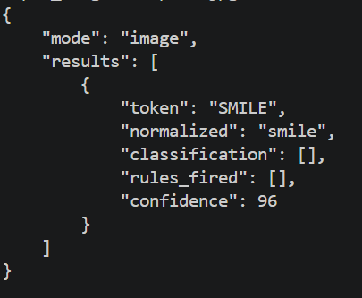

## Install Dependencies
pip install pytest
pip install pytesseract pillow opencv-python

-----------------------------

## ✅ Student Checklist

### Core Functionality
- `--text` mode prints structured JSON output with rules fired  
- `--image` mode performs OCR and token classification  
- Lexicon dynamically loaded from `--lexicon` path  

### Rule-Based System
-  Implemented rules:
  - Date detection (`YYYY-MM-DD`)
  - Number detection
  - Proper noun detection
  - Hyphenated word detection
  - Token length validation  
   Each rule documented and explained in README  

### Performance & Analysis
- [x] Complexity review includes:
  - Big-O analysis (time & space)
  - Empirical runtime measurements  
- [x] Observations and trade-offs discussed  

### Testing
-  Unit tests implemented for:
  - Tokenizer
  - Rules
  - OCR post-processing  
-  Tests executed using `pytest`  

### Submission Requirements
- [x] GitHub repository link submitted  
- OneDrive video demo (Teams recording) submitted  

### Documentation
#### Text
python cli.py --lexicon data/lexicon_en.txt --text "<Enter text here>"

#### Image
python cli.py --lexicon data/lexicon_en.txt --image data/sample_images/sample3.jpg

#### Sample Output
#### Image:

#### Text:

-----------------------------
