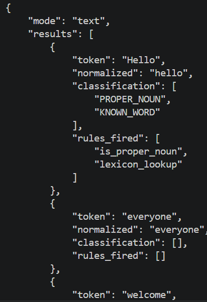
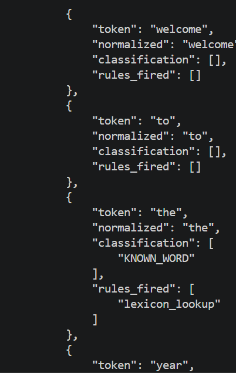
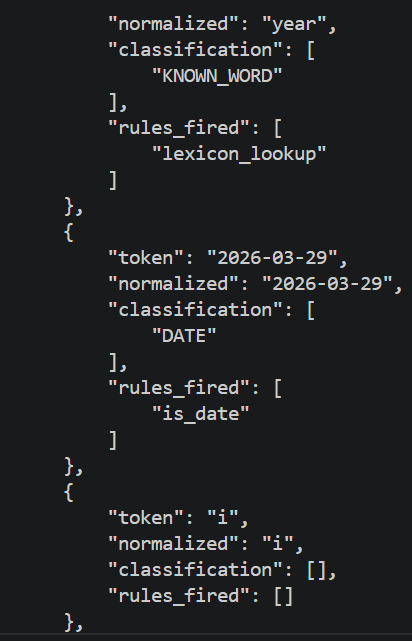
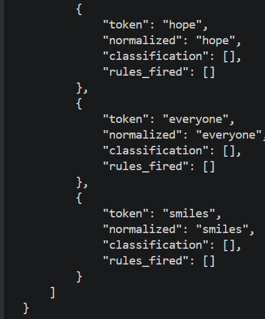

## Install Dependencies
pip install pytest
pip install pytesseract pillow opencv-python

-----------------------------

## ✅ Student Checklist

### Core Functionality
- `--text` mode prints structured JSON output with rules fired  
- `--image` mode performs OCR and token classification  
- Lexicon dynamically loaded from `--lexicon` path  

## 🧠 Rule-Based Classification

The system uses a rule-based approach to classify tokens. Each rule is applied independently, and multiple rules can fire for a single token.

### 1. Date Detection (`is_date`)
- **Purpose:** Identify tokens that follow a date format.
- **Pattern Used:** `YYYY-MM-DD`
- **Example:** `2026-01-06`
- **Logic:** Uses a regular expression to match exactly 4 digits, followed by a hyphen, 2 digits, another hyphen, and 2 digits.
- **Why Important:** Dates are common structured data and should be recognized separately from normal words.

---

### 2. Number Detection (`is_number`)
- **Purpose:** Detect numeric values.
- **Pattern Used:** Integers and decimals (e.g., `123`, `3.14`)
- **Logic:** Uses regex to match digits with an optional decimal part.
- **Why Important:** Numbers are treated differently from words in many NLP tasks.

---

### 3. Proper Noun Detection (`is_proper_noun`)
- **Purpose:** Identify capitalized words that may represent names.
- **Pattern Used:** First letter uppercase, rest lowercase (e.g., `John`)
- **Logic:** Matches tokens starting with a capital letter followed by lowercase letters.
- **Why Important:** Helps distinguish names from regular words.

---

### 4. Lexicon Lookup (`KNOWN_WORD`)
- **Purpose:** Check if a token exists in a predefined dictionary.
- **Logic:** Uses a Python `set` for fast lookup.
- **Example Lexicon Words:** `hello`, `world`, `state`, `art`
- **Why Important:** Confirms whether a word is recognized/valid in the system.

---

### 5. Hyphenated Word Detection (`is_hyphenated`)
- **Purpose:** Detect compound words joined by hyphens.
- **Example:** `state-of-the-art`
- **Logic:** Splits the token by `-` and checks if all parts exist in the lexicon.
- **Why Important:** Many valid English words are hyphenated and should be treated as meaningful units.

---

### 6. Token Length Validation (`is_too_long`)
- **Purpose:** Detect unusually long or invalid tokens.
- **Rule:** Tokens longer than 20 characters are flagged.
- **Why Important:** Helps catch OCR errors or corrupted text.

### Performance & Analysis
- [x] Complexity review includes:
  - Big-O analysis (time & space)
  - Empirical runtime measurements  
- [x] Observations and trade-offs discussed

### Limitations

- OCR struggles with noisy or stylized text  
- Lexicon is limited to predefined words  
- Rules are pattern-based, not context-aware  

### Testing
-  Unit tests implemented for:
  - Tokenizer
  - Rules
  - OCR post-processing  
-  Tests executed using `pytest`

## 📝 Changelog

### v1.2.0 – Final Submission
- Added confidence-based OCR filtering
- Improved image preprocessing (grayscale + thresholding)
- Fixed import errors in OCR module
- Added full test suite (tokenizer, rules, OCR placeholder)
- Completed README with explanations and examples
- Added Complexity Review (theory + measurements)

---

### v1.1.0 – OCR Integration
- Integrated Tesseract OCR using pytesseract
- Added image mode (`--image`)
- Implemented OCR token post-processing
- Connected OCR output to rule-based classifier

---

### v1.0.0 – Core System
- Implemented text mode (`--text`)
- Built tokenizer and normalization functions
- Added lexicon loading from file
- Implemented rule-based classification:
  - Date detection
  - Number detection
  - Proper noun detection
  - Hyphenated word detection
  - Token length validation

### Submission Requirements
- [x] GitHub repository link submitted  
- OneDrive video demo (Teams recording) submitted: https://hauph-my.sharepoint.com/:v:/g/personal/aztinio_student_hau_edu_ph/IQCR_A4pN6BXQKOvg6qMkPHvAf0Mb3F25YTMf0GVwlRUbPo?nav=eyJyZWZlcnJhbEluZm8iOnsicmVmZXJyYWxBcHAiOiJPbmVEcml2ZUZvckJ1c2luZXNzIiwicmVmZXJyYWxBcHBQbGF0Zm9ybSI6IldlYiIsInJlZmVycmFsTW9kZSI6InZpZXciLCJyZWZlcnJhbFZpZXciOiJNeUZpbGVzTGlua0NvcHkifX0&e=AxbdS3
- https://hauph-my.sharepoint.com/:v:/g/personal/aztinio_student_hau_edu_ph/IQBxofVcUCnkQoouiip6xly8AbPynY5mlqagtJ8uVrCu7Fw?nav=eyJyZWZlcnJhbEluZm8iOnsicmVmZXJyYWxBcHAiOiJPbmVEcml2ZUZvckJ1c2luZXNzIiwicmVmZXJyYWxBcHBQbGF0Zm9ybSI6IldlYiIsInJlZmVycmFsTW9kZSI6InZpZXciLCJyZWZlcnJhbFZpZXciOiJNeUZpbGVzTGlua0NvcHkifX0&email=mlsalenga%40hau.edu.ph&e=RwHKKK

### Documentation
#### Text
python cli.py --lexicon data/lexicon_en.txt --text "<Enter text here>"

#### Image
python cli.py --lexicon data/lexicon_en.txt --image data/sample_images/sample3.jpg

#### Sample Output
#### Image:

#### Text:

-----------------------------
